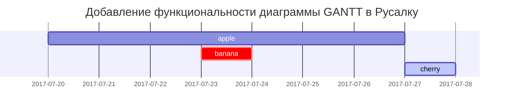

Этот пост призван показать рендеринг синтаксиса Markdown на [**Chirpy**](https://github.com/cotes2020/jekyll-theme-chirpy/fork), вы также можете использовать его в качестве примера написания текста. Итак, давайте начнем рассматривать текст и типографику..


## Названия
---
# H1 - заголовок

<h2 data-toc-skip>H2 - заголовок</h2>

<h3 data-toc-skip>H3 - заголовок</h3>

<h4>H4 - заголовок</h4>
---
<br>

## Параграф

Я бродил одиноко, как облако.

Что плывет высоко над долинами и холмами,

И вдруг я увидел толпу,

толпу золотых нарциссов;

На берегу озера, под деревьями,

Трепещущих и танцующих на ветру.

## Списки

### Упорядоченный список

1. Первый
2. Второй
3. Третий

### Неупорядоченный список

- Глава
  - Раздел
    - Параграф

### Список задач

- [ ] Список Дел
- [x] Завершено
- [ ] Победить COVID-19
  - [x] Производство вакцин
  - [ ] Восстановление экономики
  - [ ] Люди снова улыбаются

### Список описаний

Солнце
: звезда, вокруг которой вращается Земля

Луна
: естественный спутник Земли, видимый в отраженном свете от Солнца

## Блок-цитата

> В этой строке отображается Блок-цитата.

## Подсказки

> Пример отображения подсказки типа `tip`.
{: .prompt-tip }

> Пример отображения подсказки типа `info`.
{: .prompt-info }

> Пример отображения подсказки типа `warning`.
{: .prompt-warning }

> Пример отображения подсказки типа `danger`.
{: .prompt-danger }

## Таблицы

| Компания                     | Контакт          | Страна  |
|:-----------------------------|:-----------------|--------:|
| Новый Дом                    | Мария Иванова    | Россия  |
| Island Trading               | Хеленн Беннет    | Канада  |
| Magazzini Alimentari Riuniti | Гиованни Андерс  | Италия  |

## Ссылки

<http://127.0.0.1:4000>

## Сноски

Щелкните по крючку, и вы найдете сноску[^footnote], а вот еще одна сноска[^fn-nth-2].

## Изображения

- По умолчанию (с надписью)

{: width="972" height="589" }
_Выравнивание по всей ширине экрана и по центру_

<br>

- Тень

{: .shadow width="1548" height="864" style="max-width: 90%" }
_эффект тени (виден в режиме света)_

<br>

- Выровненные по левому краю

{: width="972" height="589" style="max-width: 70%" .normal}

<br>

- Влево

  {: width="972" height="589" style="max-width: 200px" .left}
   " Часто бывает так, что смысл текста не имеет большого значения, а важен только его объем или структура. Генератор текста онлайн позволит задать необходимое количество слов, из которых будут сформировано указанное Вами число абзацев. Правда, смысл сгенерированный текст иметь не будет, но ведь этого нам и не требуется! Бессмысленный текст используется для заполнения пространства. Классическая проза, бизнес, юмор и многие другие темы. "

<br>

- Вправо

  {: width="972" height="589" style="max-width: 200px" .right}
  " Часто бывает так, что смысл текста не имеет большого значения, а важен только его объем или структура. Генератор текста онлайн позволит задать необходимое количество слов, из которых будут сформировано указанное Вами число абзацев. Правда, смысл сгенерированный текст иметь не будет, но ведь этого нам и не требуется! Бессмысленный текст используется для заполнения пространства. Классическая проза, бизнес, юмор и многие другие темы. "

<br>

## Русалка - это язык разметки для создания диаграмм и блок-схем



## Математика

Математика, основанная на [**MathJax**](https://www.mathjax.org/):

$$ \sum_{n=1}^\infty 1/n^2 = \frac{\pi^2}{6} $$

Когда $a \ne 0$, есть два решения $ax^2 + bx + c = 0$ и они следующие

$$ x = {-b \pm \sqrt{b^2-4ac} \over 2a} $$

## Встроенный код

Это пример `Встроенный код`.

## Блок кода

### Общий

```
Это обычный фрагмент кода, без подсветки синтаксиса и номера строки.
```

### Специфические языки

#### Console

```console
$ env |grep SHELL
SHELL=/usr/local/bin/bash
PYENV_SHELL=bash
```

#### Shell

```bash
if [ $? -ne 0 ]; then
    echo "The command was not successful.";
    #do the needful / exit
fi;
```

### Определенное имя файла

```sass
@import
  "colors/light-typography",
  "colors/dark-typography"
```
{: file='_sass/jekyll-theme-chirpy.scss'}

## Обратные сноски

[^footnote]: Источник сноски
[^fn-nth-2]: Источник 2-й сноски
